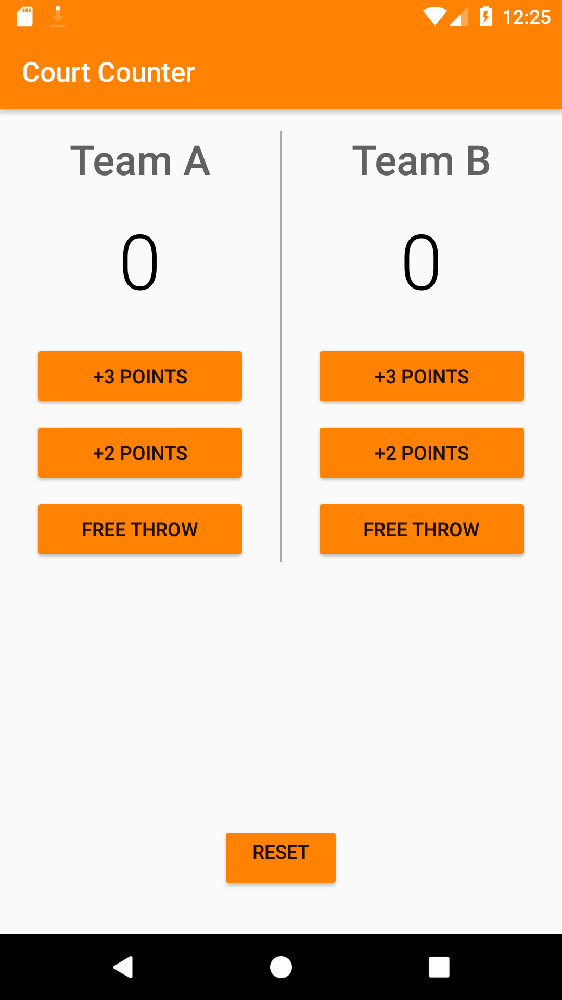
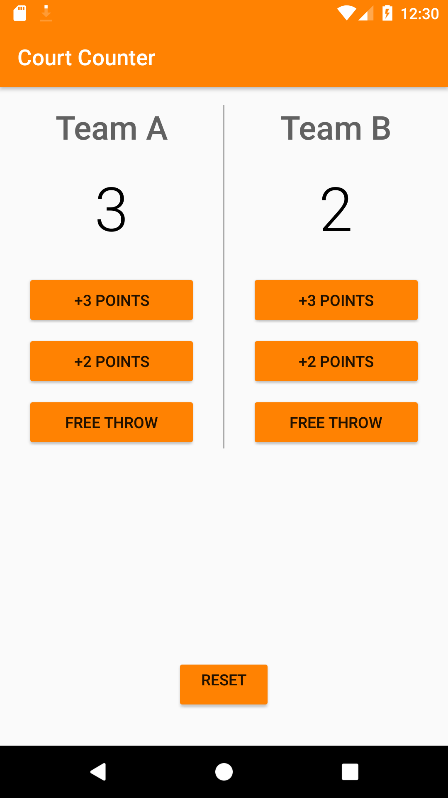

# Court-Counter
## This is a simple app that lets you keep track of the scores of two basketball teams.

## Pre-requisites
* Android SDK v24
* Android Build Tools v23.0.3
* Android Support Repository v24.1.1


## Installation
Clone this repository and import into **Android Studio**
```bash
git clone https://github.com/neelangshu007/Court-Counter-App.git
```

## Getting Started
This sample uses the Gradle build system. To build this project, use the "gradlew build" command or use "Import Project" in Android Studio.


## Contributing
1. Fork it
2. Create your feature branch (git checkout -b my-new-feature)
3. Commit your changes (git commit -m 'Add some feature')
4. Push your branch (git push origin my-new-feature)
5. Create a new Pull Request

## Court Counter App Screenshots




